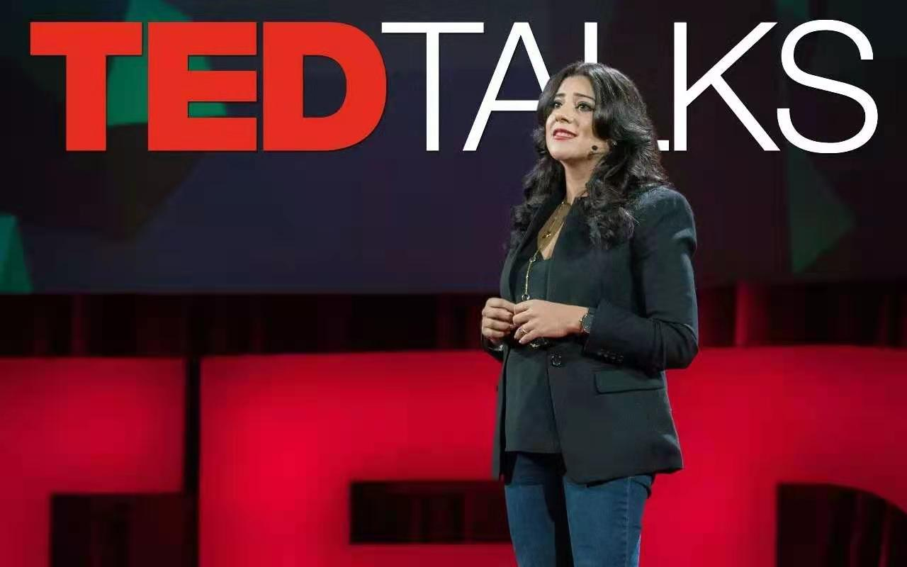
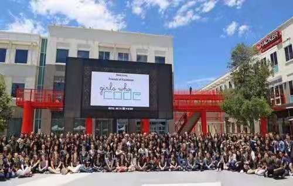
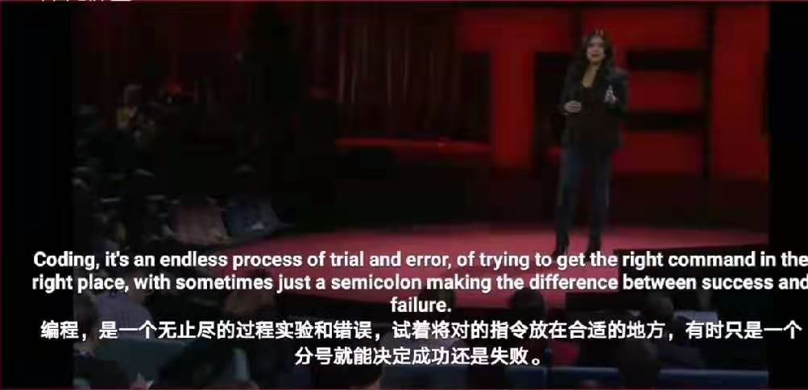

# 科技遇见她

## 分享我与科技的#HERstory

### Reshma Saujani: Teach girls bravery,not perfection

#### 做勇敢的女孩，而非完美

**Reshma Saujani——让更多女性用编程改变世界

_Reshma Saujani是美国知名的律师和政治家，她的TED演讲《女性要勇敢而非完美》对想要步入STEM领域的我给了很大的信心和鼓励，我可以去尝试，我可以有更多的选择。_

<iframe src="//player.bilibili.com/player.html?aid=501509396&bvid=BV1oN41197nt&cid=293986383&page=1" scrolling="no" border="0" frameborder="no" framespacing="0" allowfullscreen="true"> </iframe>

> Most girls are taught to avoid risk and failure. We're taught to smile pretty, play it safe, get all A's. Boys, on the other hand, are taught to play rough, swing high, crawl to the top of the monkey bars and then just jump off headfirst. And by the time they're adults, whether they're negotiating a raise or even asking someone out on a date, they're habituated to take risk after risk. They're rewarded for it.

> It's often said in Silicon Valley, no one even takes you seriously unless you've had two failed start-ups. In other words, we're raising our girls to be perfect, and we're raising our boys to be brave. Some people worry about our federal deficit, but I, I worry about our bravery deficit. Our economy, our society, we're just losing out because we're not raising our girls to be brave. The bravery deficit is why women are underrepresented in STEM, in C-suites, in boardrooms, in Congress, and pretty much everywhere you look.

在演讲中Saujani表示，社会一直默认的教育方式是从小告诉女孩要完美和细心，而男孩要勇敢和耐挫，她自己一直遵从着这样的设定，直到33岁时，她第一次做了件勇敢但看似并不完美的事——参选国会议员，虽然结果以失败告终，但这件事给她带来了很多思考和领悟，从而也彻底改变了她的人生轨迹与目标。

在2010年春天的一个晚上，当Saujani看到自己在众议院议员的竞选中只拉到了19%的投票时，这位前著名律师放弃了自己的工作，花了10个月时间四处漫游露营，面临着破产、被同行轻视的困境，并且没有给自己留下任何后路。有一天她突然想起自己在议员竞选的过程中曾去过很多学校，当时内心一直有个疑问：大部分学校的计算机实验室都挤满了男生，忙着写代码完成各种任务，梦想成为下一个乔布斯或者扎特伯格。而女生在哪呢？

可以肯定的是技术产业缺乏人才。Saujani表示，在美国，至少有50万个计算机技术相关的职位空缺，而71%的STEM领域的工作需要掌握编程语言的人才。但实际情况是，2016-2017学年全美范围内仅有4万名计算机专业的毕业生，而最近的调查显示，程序员的工作可以让他们每年除开生活成本后有大概12万美金的收入。即便如此（人才短缺、薪酬优渥），女性在这一行所占的比例仍是下降的。1995年，37%的技术类劳动力是由女性构成的，如今这个数字是24%，而研究表明到2025年会继续下降到22%。 Saujani对填补计算机领域的男女比率差距抱有很大的热情，通过研究，她发现一些人类社会固有的文化因素导致了女性技术人员的不断减少。 对于入门者来说，如果你看不到真正的目标，你就无法行动。而现如今大部分电影和电视剧都将STEM领域的从业人员刻画成了一群几天不洗澡、住在地下室、桌上摆满红牛饮料罐的邋遢男孩——女孩很难从媒体得到真正的、正面的技术女性形象，因此也无法去建立自己的目标。 “女孩们看到这些荧幕上的男性技术员形象，会说，我不想成为这样的人，也不想和这样的人交朋友。” Saujani笑着说。

更值得警醒的是，社会普遍接受女孩子们表示自己不擅长数学或者科学相关的学科，不会有人提出异议或批评，好像她们天生就应该这样。但除了这些文化因素外，Saujani指出，最重要的一点是，整个人类社会都倾向于溺爱和保护女孩们。男孩们从小就被教育要敢于承担风险并且不要害怕被拒绝，或者说更大胆更“厚脸皮”，但很少有人会要求女孩们接受自己的不完美，反而在多数时候都给予她们名不副实的夸赞，所以当遇到困难时，她们比较难去面对自己的不足并想办法解决。事实是，在很多编程课堂上，女孩们常常会对着空白的屏幕发呆而不愿意敲下任何一行错误的代码——她们不敢开始，害怕面对失败。

 为了扭转现状，Saujani成立了“Girls Who Code”这一非盈利机构来支持女孩们进入技术领域。免费提供培训志愿者和教学课程来帮助本地的教育者们设立女孩学编程俱乐部。从2012年开始，机构孵化了80多个暑期沉浸式教学项目、成立了近1000个女孩学编程的俱乐部，大量地使用机器人、编程学习网站和APP等教育工具。到目前为止，“Girls Who Code”已经覆盖到了全美各大洲的超过4万个女孩，从这里走出去的女孩们，90%都在不同程度上表示出了继续学习编程的意愿。

Saujani在乎的是，女性怎样去更有力地解决现实生活中的问题，用更强大的创造力改变世界，而编程是目前看来最值得她们掌握的技能。 “我一直坚信富有创新能力的女性很多，但如果我们不教会她们编程，她们就会渐渐变成局外人，失去改变这个世界的资格。” 另一方面，Saujani觉得“编程的核心，是关于面对失败”，作为一个过来人，她明白当人走到一个死胡同中时，必须要接受事情的不完美和局限性，沉浸在挑战中而不是畏惧它，才有可能找到出路。而女孩，因为社会原因，更需要被鼓励去面对自己的不完美并且勇敢地走出第一步。

> Coding, it's an endless process of trial and error, of trying to get the right command in the right place, with sometimes just a semicolon making the difference between success and failure. 
>
> **编程，是一个无止尽的过程实验和错误，试着将对的指令放在合适的地方，有时只是一个分号就能决定成功还是失败。**
>
> Code breaks and then it falls apart, and it often takes many, many tries until that magical moment when what you're trying to build comes to life. It requires perseverance. It requires imperfection.

感谢这个机会让我更坚定决心学习编程，我愿意去探索、愿意去尝试，我很想往前冲。
我有信心去勇敢的迈出一步，只有足够坚强，拼搏，付出你的时间，用毅力去坚持，我相信自己一定能够如愿以偿。

**越不可越之山，则登其巅；渡不可渡之河，则达彼岸。

